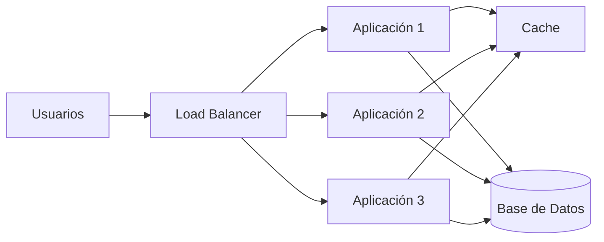

# ADR-001: Arquitectura para la cooperativa de buses

## Contexto

La plataforma de la cooperativa de buses ha crecido hasta alcanzar aproximadamente 50,000 usuarios.

El sistema presenta picos importantes de tráfico alrededor de las 5:00 AM, especialmente durante la compra y reserva de boletos.

La principal necesidad es mantener un buen rendimiento durante esos períodos sin aumentar innecesariamente la complejidad de la solución.

Los atributos de calidad prioritarios son:

- Rendimiento.
- Disponibilidad.
- Escalabilidad.
- Mantenibilidad.
- Costo operativo razonable.

La gerencia ha propuesto utilizar microservicios; sin embargo, la decisión debe evaluarse según las necesidades reales del sistema y no solamente por tendencias tecnológicas.

## Opciones evaluadas

### Opción 1: Monolito modular

Consiste en mantener la aplicación como una sola unidad desplegable, pero organizada internamente en módulos bien separados.

#### Ventajas

- Menor complejidad de desarrollo y despliegue.
- Más fácil de probar y depurar.
- Permite mantener transacciones simples.
- Puede escalar horizontalmente utilizando varias instancias detrás de un balanceador de carga.
- Tiene menor costo operativo que una arquitectura distribuida.

#### Desventajas

- La aplicación completa debe desplegarse como una unidad.
- Si el sistema crece demasiado, algunos módulos pueden necesitar separarse posteriormente.
- El escalamiento puede ser menos granular que en microservicios.

### Opción 2: Microservicios

Consiste en dividir el sistema en varios servicios independientes, por ejemplo: usuarios, reservas, pagos y notificaciones.

#### Ventajas

- Cada servicio puede escalar de forma independiente.
- Permite desplegar componentes sin desplegar todo el sistema.
- Puede facilitar el trabajo de múltiples equipos independientes.

#### Desventajas

- Aumenta considerablemente la complejidad.
- Requiere comunicación por red entre servicios.
- Introduce posibles fallos parciales.
- Requiere mayor observabilidad y monitoreo.
- Puede complicar las transacciones.
- Para un único equipo o un sistema que todavía no necesita esa separación, puede ser sobrearquitectura.

### Opción 3: Serverless

Consiste en utilizar funciones que se ejecutan bajo demanda ante determinados eventos o solicitudes.

#### Ventajas

- Escalamiento automático.
- Se paga principalmente por ejecución.
- Puede ser conveniente para tareas esporádicas como notificaciones o procesos secundarios.

#### Desventajas

- Puede presentar cold starts.
- Existen límites de tiempo y ejecución.
- Puede generar dependencia del proveedor.
- No necesariamente es la mejor opción para toda la lógica principal de reservas y pagos.

## Decisión

Se utilizará un monolito modular como arquitectura principal.

La aplicación se organizará internamente por módulos, por ejemplo:

- Usuarios.
- Reservas.
- Pagos.
- Rutas.
- Notificaciones.

Para atender los picos de tráfico de las 5:00 AM se aplicarán primero mecanismos de escalabilidad antes de dividir el sistema en microservicios.

Las principales medidas serán:

1. Uso de caché para información consultada frecuentemente, como rutas y horarios.
2. Escalamiento horizontal de la aplicación.
3. Uso de un balanceador de carga.
4. Optimización e indexación de la base de datos.
5. Evaluación de réplicas de lectura si la base de datos se convierte en cuello de botella.

No se seleccionan microservicios inicialmente porque el problema principal identificado es el aumento de tráfico y no la necesidad de independencia entre múltiples equipos de desarrollo.

## Consecuencias

### Consecuencias positivas

- Menor complejidad operativa.
- Desarrollo y despliegue más sencillos.
- Menor costo de infraestructura.
- Facilidad para realizar pruebas y depuración.
- Posibilidad de escalar horizontalmente durante los períodos de mayor demanda.

### Consecuencias negativas

- El sistema continuará siendo una sola unidad desplegable.
- Algunos módulos podrían necesitar separarse en el futuro.
- El escalamiento no será tan granular como en una arquitectura de microservicios.

Si en el futuro un módulo presenta necesidades de escalamiento independientes o varios equipos requieren autonomía, podrá extraerse progresivamente mediante un enfoque Strangler Fig.

## Diagrama de arquitectura propuesta

