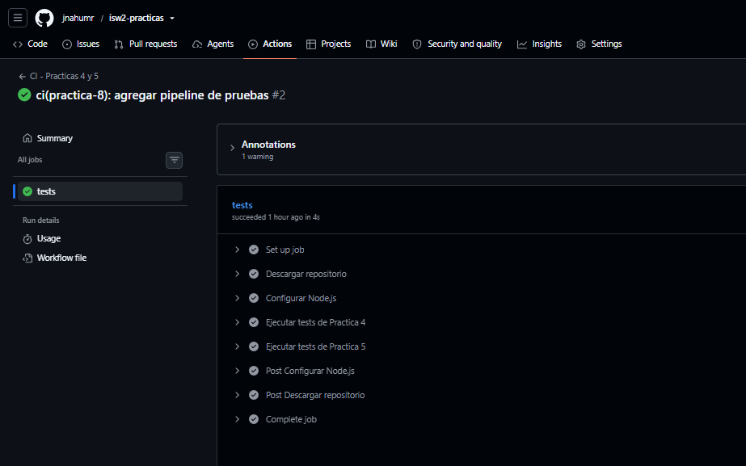

# Práctica 8 - Pipeline verde + URL viva

## Evidencia de GitHub Actions

El pipeline de Integración Continua fue ejecutado correctamente mediante GitHub Actions.

Se verificaron automáticamente los tests correspondientes a las Prácticas 4 y 5, obteniendo un resultado exitoso.

### Resultado

- Workflow: CI - Practicas 4 y 5
- Tests Práctica 4: PASS
- Tests Práctica 5: PASS
- Estado del pipeline: SUCCESS

## URL pública

El repositorio fue publicado mediante GitHub Pages y se encuentra disponible públicamente en:

https://jnahumr.github.io/isw2-practicas/

## ¿Qué ejecuta el pipeline y qué agregaría después?

1. El pipeline se ejecuta automáticamente con cada `push` y `pull_request`.
2. GitHub Actions descarga el repositorio y configura Node.js.
3. Se ejecutan automáticamente los tests correspondientes a la Práctica 4.
4. También se ejecutan los tests de la Práctica 5 para comprobar que los cambios no rompan el código existente.
5. Como siguiente mejora agregaría análisis de calidad de código, cobertura de pruebas y validaciones adicionales antes de permitir un merge a `main`.

## Captura del run exitoso

La evidencia del workflow ejecutado correctamente se agrega a continuación:

